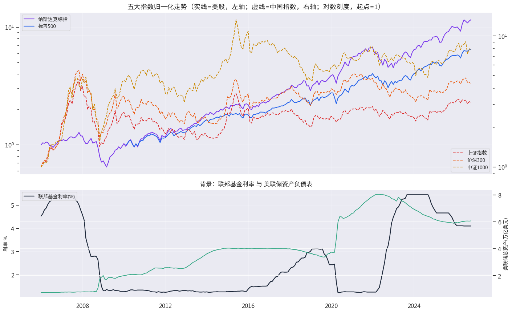
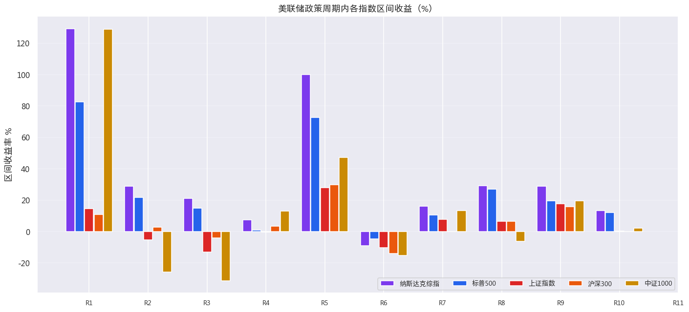
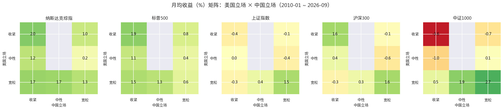
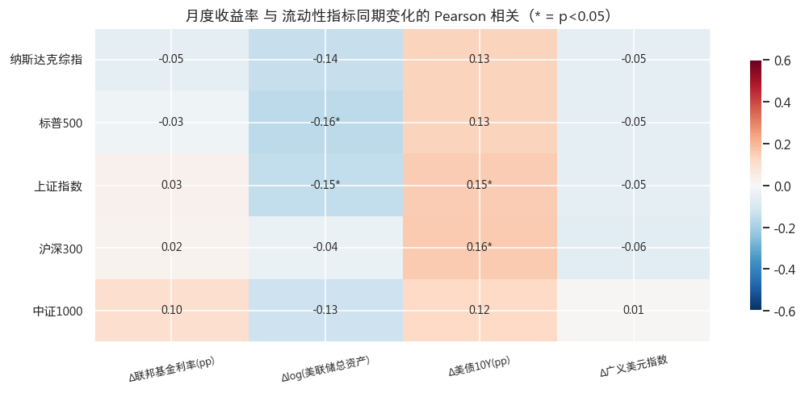
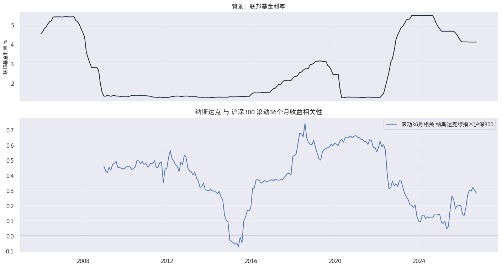

# China-US Liquidity Monitor · 中美流动性与五大指数监测

监测中美流动性政策（美国 = 利率 + 资产负债表；中国 = 央行表态 + 政策取向）与五大指数（纳斯达克综指、标普500、上证指数、沪深300、中证1000）的传导关系，输出自包含 HTML 研究报告 + Excel 数据包。

## 特性

- **自包含 HTML 报告**：单文件输出，图表以 base64 内嵌，无需网络与外部资源即可离线查看。
- **双源数据架构**：Tushare Pro（中国指数 + 美股全球指数）+ FRED（美国宏观，免密钥），并带兜底数据源。
- **周期回测 + 组合矩阵 + 相关性分析**：按政策立场（宽松 / 中性 / 收紧）划分周期，回测各周期下五大指数表现，构建中美立场组合矩阵，输出全指数相关性矩阵与滚动相关。
- **可定时自动化**：三脚本管道（fetch → analyze → report）解耦，可接入 cron 或 CI 定时产出最新报告。

## 效果预览











> ⚠️ 截图为演示数据（数值经确定性虚拟化变换），仅展示样式与功能，非真实行情。

## 核心发现

以下为公开历史数据的回测结论（定性描述，详见报告输出）：

1. **美国流动性主导美股，但作用在周期级别而非月度级别**：月频相关性普遍 |r| < 0.15，统计上不显著；政策立场的意义体现在跨周期维度。
2. **中国立场是 A 股的关键区分变量**：同样的美国周期背景下，中国政策取向不同，A 股表现差异显著。
3. **"美宽 × 中宽"组合下 A 股月均收益显著为正**：中美流动性立场同宽的月份是 A 股历史上最友好的环境。
4. **中美股市联动明显脱钩**：标普500 × 沪深300 月收益相关性 2010–2020 约 0.62，2021–2026 降至约 0.17。

## 快速开始

### 环境要求

- Python 3.12
- 网络访问（fetch_data.py 需要；analyze + report 用随仓库的样例数据即可离线运行）

### 安装依赖

```bash
pip install -r requirements.txt
```

### 三步运行

```bash
python fetch_data.py          # 抓数（需要 Tushare token + 网络）
python analyze.py             # 回测 + 相关性 + 出图 + Excel
python generate_report.py     # 自包含 HTML 报告
```

零配置体验：仓库自带样例数据 `data/panel_monthly.csv`（公开行情数据），克隆后可直接运行后两步：

```bash
python analyze.py && python generate_report.py
```

### 配置 Tushare Token

token 从 **以下两种方式的任意一种** 读取，仓库中不含任何 token：

1. **环境变量**：

   ```bash
   export TUSHARE_TOKEN="你的token"
   ```

2. **token 文件**：在用户主目录下创建 `.tushare_token` 文件，内容仅一行 token。

token 注册地址：https://tushare.pro/user/token

## 数据来源与覆盖

| 来源 | 用途 | 说明 |
|------|------|------|
| Tushare Pro · `index_monthly` / `index_daily` | 上证指数 000001.SH、沪深300 000300.SH、中证1000 000852.SH 当月 MTD | 需 token |
| Tushare Pro · `index_global` | 纳斯达克综指 IXIC、标普500 SPX 日频聚合月线（2010 起） | 需 token |
| FRED（免密钥） | FEDFUNDS / WALCL / DGS10 / DTWEXBGS 宏观序列；NASDAQCOM 回填纳指 2005–2010 段 | 无需 token |
| 腾讯行情（兜底） | 网络受限时的备选抓数路径 | 自动降级 |

**数据覆盖**（月度面板统一自 2005-12 起）：

- 纳斯达克综指：全段覆盖（2005–2010 段由 FRED NASDAQCOM 回填）
- 标普500：自 2010-01 起
- 中证1000：自 2005-01 起（Tushare 回溯）
- 上证指数 / 沪深300：指数本身分别自 1991 / 2002 起有数据，面板统一截取 2005-12 起

## 项目结构

```text
.
├── fetch_data.py            # 抓数：Tushare + FRED + 兜底 → data/panel_monthly.csv
├── analyze.py               # 周期回测 / 组合矩阵 / 相关性 / 5 图 → stats.json + charts/ + xlsx
├── generate_report.py       # 自包含 HTML 报告（base64 内嵌图）
├── requirements.txt
├── data/
│   └── panel_monthly.csv    # 样例月度面板（公开行情数据）
├── HANDOVER.md              # 维护手册：SOP / 审查记录 / 故障排查
└── docs/
    └── screenshots/         # README 效果预览截图
```

## 方法论与已知局限

**方法论概要**：政策周期标签（美国 / 中国各一组）定义在 `analyze.py` 顶部的 `US_REGIMES` / `CN_REGIMES` 两个列表中，立场取 1（宽松）/ 0（中性）/ -1（收紧）；划分依据仅限官方一手文件（federalreserve.gov / pbc.gov.cn）。管道按 fetch → analyze → report 三阶段解耦，产物包括 `stats.json`、`charts/` 图表与自包含 HTML 报告。

**已知局限**（务必阅读）：

- 政策立场标签为语义判断，存在主观空间；
- 事后划分存在前视偏差（look-ahead bias）；
- 区间收益对起止月敏感；
- 部分组合矩阵格样本量较小；
- 相关 ≠ 因果；
- 结构性事件（贸易战 / 疫情 / 地产）构成混杂因素。

完整 SOP、审查记录与故障排查见 [HANDOVER.md](HANDOVER.md)。

## 免责声明

本项目仅供研究与学习用途，不构成任何投资建议。报告中所有结论基于公开历史数据回测，过往表现不代表未来收益。使用者据此操作，风险自负。
